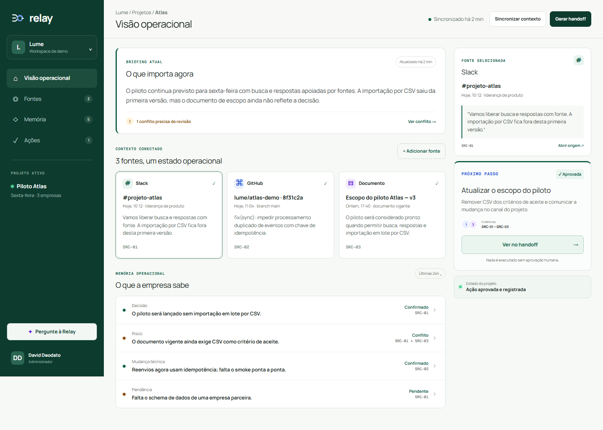

# Relay

> Contexto que vira ação — sem perder a fonte.

[Demo pública](https://relay-openai-hackathon.vercel.app) · [Brand book](docs/BRAND_BOOK.md) · [Roteiro do vídeo](docs/DEMO_SCRIPT.md)

[Take-base automático do fluxo (22s, sem narração)](docs/relay-demo-raw.mp4)



## O problema

Em equipes pequenas, decisões ficam espalhadas entre mensagens, commits, documentos e conversas. O resultado não é apenas dificuldade de busca: a empresa perde o motivo das decisões, trabalha com versões conflitantes e demora para transformar contexto em próximo passo.

## A proposta

Relay funciona como uma mente operacional compartilhada. Ela conecta fontes autorizadas, preserva proveniência e transforma contexto desestruturado em:

- decisões e pendências estruturadas;
- conflitos entre fontes;
- riscos técnicos ou operacionais;
- ações revisáveis e aprovadas por humanos;
- handoffs prontos para quem entra no projeto.

Chat é uma interface secundária. O núcleo do produto é a cadeia:

`fonte → evidência → interpretação → incerteza → ação humana → registro`

## Fluxo demonstrado

1. Três fontes representam Slack, GitHub e documento de escopo.
2. Relay compila o briefing e a memória operacional.
3. A plataforma detecta que a decisão recente retirou CSV, enquanto o documento ainda o exige.
4. Uma ação é sugerida com `SRC-01 + SRC-03` como evidência.
5. O usuário aprova a ação; o estado persiste no navegador.
6. Um handoff reúne objetivo, decisão, risco, pendência e próximo passo.
7. “Pergunte à Relay” consulta a OpenAI Responses API com contexto e fontes.

Os dados empresariais exibidos são um fixture fictício preparado para a demonstração. A chamada à OpenAI é real; quando a variável não está disponível, a rota retorna uma contingência explicitamente marcada.

## Stack

- Next.js 16 e React 19;
- OpenAI Responses API;
- Vercel;
- TypeScript e CSS responsivo;
- persistência local para o estado aprovado da demo.

## Executar

```bash
npm install
cp .env.example .env.local
npm run dev
```

Variáveis:

```env
OPENAI_API_KEY=
OPENAI_MODEL=gpt-5-mini
```

Checks:

```bash
npm test
npm run lint
```

## Equipe

- Davi Nascimento de Jesus — `davidijesus`
- Carlos Icaro — `CIcaro`
- David Deodato — `daviddeodato`

## Limites honestos

Esta versão prioriza o fluxo demonstrável do hackathon. Conectores OAuth, permissões avançadas, banco multi-workspace e execução automática de ações ficaram fora do caminho crítico. Nenhuma ação externa é executada sem aprovação humana.
