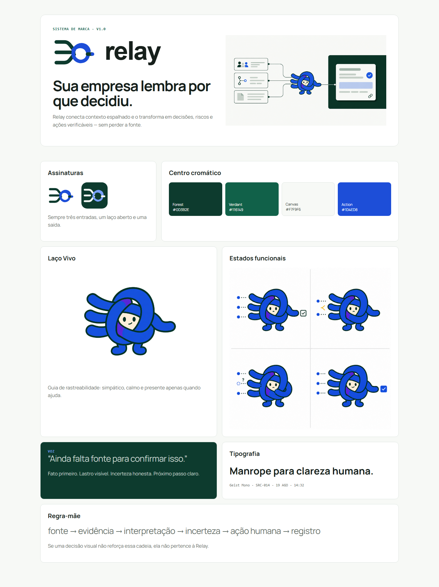
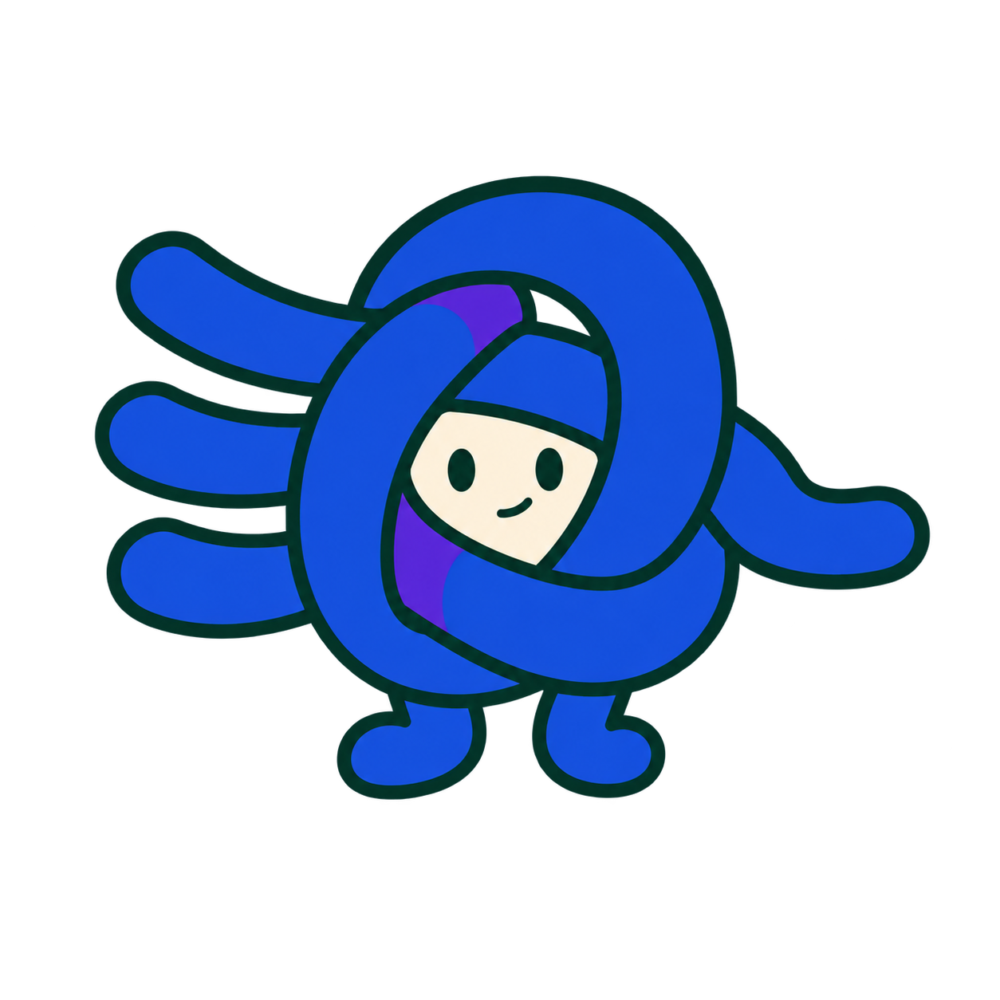
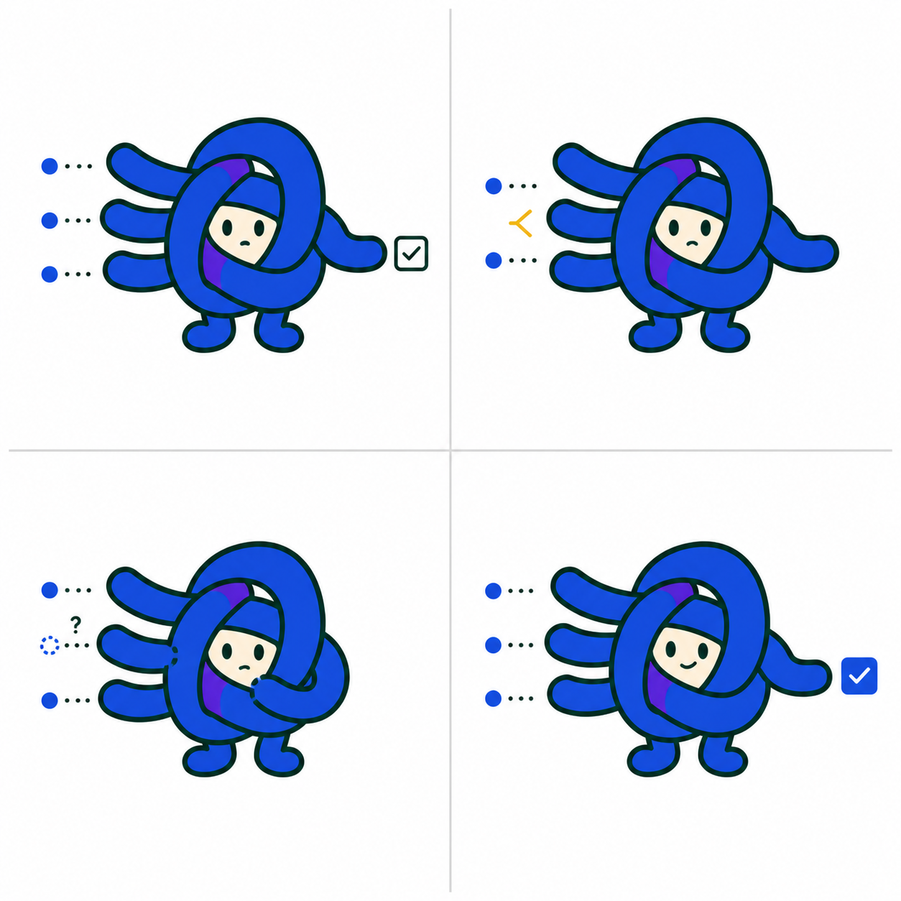
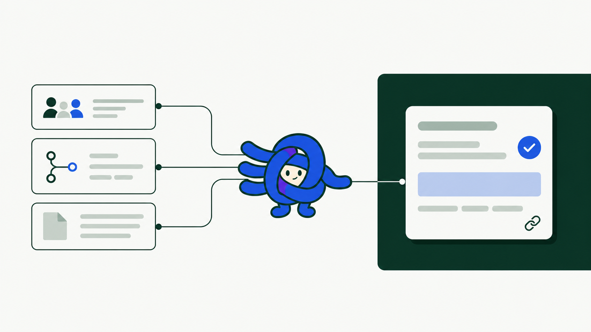

# Relay — sistema de marca

## Estado

Versão 1.0 fechada para o hackathon em 19 de agosto de 2026. **Relay** foi definido pelo usuário como nome da marca. A checagem jurídica e de disponibilidade de domínio continua fora do escopo desta etapa.

## 1. Ideia central

Relay é a mente operacional compartilhada de uma empresa pequena: conecta contexto disperso entre pessoas e ferramentas, preserva a origem e transforma esse contexto em decisões, riscos e próximos passos verificáveis.

Chat é uma entrada possível. O produto não é um chatbot, uma busca genérica, um dashboard ou um “cérebro que sabe tudo”.

### Posicionamento

**Categoria:** operational context workspace.

**Promessa:** do contexto espalhado ao próximo passo, sem perder a fonte.

**Hero:** sua empresa lembra por que decidiu — e sabe o que fazer depois.

**Subtexto:** Relay conecta mensagens, código, documentos e contribuições da equipe e os transforma em memória operacional, conflitos visíveis e ações revisáveis.

### Cadeia proprietária

`fonte → evidência → interpretação → incerteza → ação humana → registro`

## 2. Princípios

1. **Integra sem vigiar.** Só conecta fontes autorizadas e contribuições escolhidas.
2. **Lembra com lastro.** Toda afirmação importante chega à origem em até duas interações.
3. **Transforma contexto em movimento.** A experiência termina em um próximo passo revisável.
4. **É coletiva sem apagar indivíduos.** Autoria, permissão e revisão permanecem visíveis.
5. **É viva, mas calma.** Mudanças aparecem sem pulsos, brilho ou animação contínua.
6. **É próxima, não infantil.** Simpatia apoia decisões reais; não vira gamificação.

## 3. Nome

### Relay

Pronúncia recomendada em português: **“ri-lêi”**.

O nome descreve o comportamento do produto: receber sinais de origens distintas, preservar o trajeto e encaminhar uma saída útil. Ele também funciona na linguagem de produto: “Relay encontrou um conflito”, “Relay registrou a decisão” e “abra a fonte no Relay”.

### Escrita

- Marca em texto corrido: `Relay`.
- Wordmark: `relay`, em caixa baixa.
- Nunca: `RELAY.AI`, `Relay IA`, `Re-lay` ou `RLY`.

## 4. Logo

O símbolo mostra três caminhos de origem entrando em um laço aberto e saindo como uma única ação. O laço não apaga os fios: ele os organiza.

### Arquivos

- `public/brand/relay-logo-horizontal.svg`: assinatura principal.
- `public/brand/relay-mark.svg`: símbolo colorido.
- `public/brand/relay-mark-mono.svg`: aplicações monocromáticas.
- `public/brand/relay-icon.svg`: ícone de app e favicon.

### Regras

- Área de respiro: no mínimo a altura de uma das três linhas de entrada ao redor da marca.
- Tamanho mínimo do símbolo: 24 px digital; 8 mm impresso.
- Tamanho mínimo da assinatura: 104 px digital.
- Usar a versão colorida sobre branco, Canvas ou Cream.
- Sobre Forest, usar marca monocromática clara.
- Não girar, aplicar sombra, mudar proporções, fechar o laço, remover uma das três entradas ou usar a ilustração do mascote como favicon.

## 5. Mascote — o Laço Vivo

### Papel

O mascote é um guia de rastreabilidade. Ele não representa uma IA onisciente e não ocupa permanentemente a interface.

### Anatomia e significado

- três pontas à esquerda: fontes preservadas;
- corpo em laço aberto: interpretação com rastreabilidade;
- pequeno trecho violeta: inferência, sempre minoritária;
- uma ponta à direita: próximo passo organizado;
- rosto creme: presença calma e humana;
- pés mínimos: ação aterrada, não magia.

Sua identidade vem do corpo-laço. Não recebe roupa, antena, asa, tela, cabelo, luva, sapato, cérebro ou olho de vigilância.

### Personalidade

Atento, gentil, silenciosamente inteligente e um pouco curioso. A fofura vem da forma compacta e do comportamento, nunca de olhos gigantes ou pose de bebê.

### Onde aparece

- onboarding;
- empty state com uma tarefa clara;
- processamento curto;
- conflito entre fontes;
- fonte ausente;
- confirmação de ação registrada.

Não aparece como decoração em tabelas densas, navegação permanente ou toda resposta gerada.

### Estados oficiais

1. **Conectando:** sinais se aproximam das três entradas.
2. **Conflito:** duas fontes divergem; expressão preocupada, sem alarme.
3. **Fonte ausente:** uma entrada possui lacuna pontilhada.
4. **Ação registrada:** a saída termina em um check azul.

### Arquivos

- `public/brand/relay-mascot-transparent.png`: pose principal recortada.
- `public/brand/relay-mascot-chroma.png`: versão com verde chroma uniforme para vídeo/recorte; amostrar o fundo do próprio arquivo no editor.
- `public/brand/relay-mascot-states.png`: folha de estados.
- `public/brand/relay-hero.png`: ilustração narrativa de fontes para ação.

### Limite de escala

O mascote completo é ilustração e deve ser usado a partir de 96 px. Entre 24 e 64 px, usar `relay-mark.svg` ou `relay-icon.svg`; não reduzir o PNG mecanicamente.

## 6. Cor

### Marca e superfícies

| Token | Hex | Função |
|---|---|---|
| Forest | `#0D3B2E` | hero, navegação e contraste institucional |
| Verdant | `#116149` | ação primária e confirmação |
| Verdant Strong | `#0B4F3A` | hover e ênfase |
| Canvas | `#F7F9F6` | fundo geral do produto |
| Surface | `#FFFFFF` | superfícies de trabalho |
| Ink | `#17201C` | texto principal |
| Muted | `#5D6A63` | texto secundário |
| Border | `#DCE4DF` | divisórias, nunca texto |
| Cream | `#F3F7F4` | texto sobre Forest e fundos suaves |

### Estados semânticos

| Estado | Hex | Uso |
|---|---|---|
| Ação | `#1D4ED8` | próximo passo e foco acionável |
| Inferido | `#6D28D9` | interpretação ainda não confirmada |
| Pendente | `#8A4B08` | falta evidência ou decisão |
| Bloqueado | `#B42318` | risco impeditivo |

Contrastes medidos sobre branco: Ink 16,67:1; Muted 5,66:1; Verdant 7,42:1; Action 6,70:1; Inferred 7,10:1; Pending 6,79:1; Blocked 6,57:1. Cor sempre acompanha texto e ícone.

## 7. Tipografia

- **Manrope Variable:** marca, títulos, interface e comunicação.
- **Geist Mono:** IDs, fontes, horários, hashes e metadados de proveniência.

| Estilo | Tamanho/linha | Peso |
|---|---:|---:|
| Display | 44/48 | 650 |
| H1 produto | 28/34 | 650 |
| H2 | 20/26 | 620 |
| Corpo | 14/21 | 450 |
| Metadado | 12/17 | 500 |

Evitar título em caixa alta, tracking aberto e texto centralizado em superfícies operacionais.

## 8. Geometria, ícones e movimento

- base espacial: 4 px;
- escala: 8, 12, 16, 24 e 32 px;
- raio de controles: 6 px;
- raio de superfícies: 10 px;
- borda: 1 px, evitando card dentro de card;
- ícones: Lucide, 16/20 px, stroke 1,75;
- hover/foco: 120–160 ms;
- animação do trace: 220–280 ms;
- `prefers-reduced-motion`: relação aparece imediatamente.

O mascote não respira, pisca ou flutua em loop.

## 9. Tom de voz

### Personalidade verbal

Atenta, lúcida, proativa, calorosa, organizada e confiável. Nunca invasiva, onisciente, autônoma, infantil, burocrática ou solene.

### Fórmula de microcopy

`fato → lastro → incerteza → próximo passo`

### Usar

- “Esta decisão veio de duas fontes.”
- “Há um conflito que precisa de revisão.”
- “O próximo passo sugerido é…”
- “Ainda falta fonte para confirmar isso.”
- “Davi aprovou esta ação.”
- “3 fontes conectadas. 1 pendência continua aberta.”

### Evitar

- “Eu sei tudo sobre sua empresa.”
- “Capturamos automaticamente todo o conhecimento.”
- “Sua única fonte da verdade.”
- “Nossa IA entende sua organização.”
- “Deixa comigo.”
- “Insight mágico”, “superpoder” e “revolucionário”.

## 10. Aplicação no produto

A home é uma superfície operacional contínua, não um grid de métricas e não uma conversa vazia.

1. Navegação de workspace e projetos.
2. Cabeçalho com escopo, período e sincronização.
3. Briefing curto do estado real.
4. Fluxo temporal de contexto no centro.
5. Inspector de fonte à direita.
6. Ação contextual com evidências e aprovação humana.
7. “Pergunte à empresa” como painel secundário.

O gesto visual proprietário liga `fonte → trecho → interpretação → ação` com uma linha contínua. A mesma lógica aparece no logo, mascote, hero e interface.

## 11. Acessibilidade e QA

- texto normal: contraste mínimo 4,5:1;
- foco visível em todos os controles;
- estados nunca dependem apenas de cor;
- imagens possuem texto alternativo funcional;
- mascote não substitui instrução;
- interface deve permanecer compreensível sem animação;
- validar em 1440×900, 1280×720 e viewport móvel sem quebra crítica.

## 12. Uso imediato na demo

- Abrir com `relay-logo-horizontal.svg` sobre Canvas.
- Usar o hero com headline à esquerda e a ação visual à direita.
- Aplicar Forest na navegação, Canvas no produto e Action Blue somente em próximos passos.
- Mostrar o mascote uma vez no onboarding e nos estados de conflito/registro.
- No vídeo, usar a versão chroma somente quando houver composição; não exibir o verde bruto como peça de marca.
